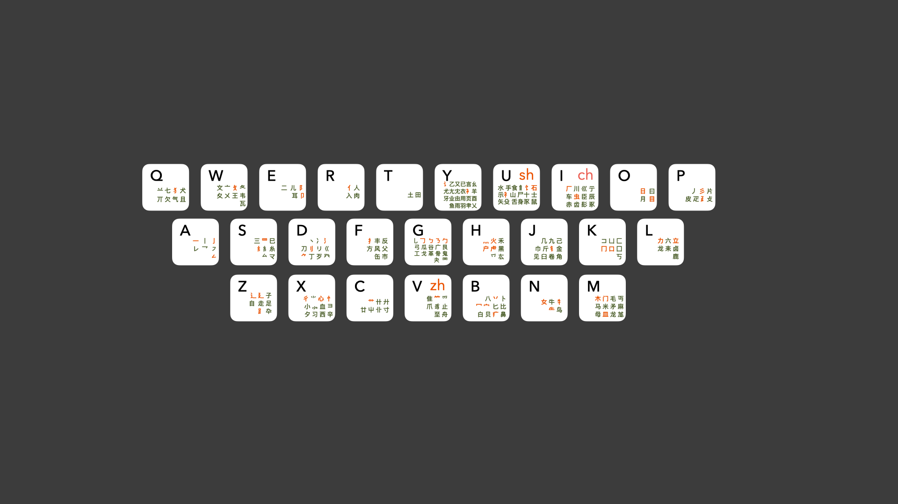

# 自然碼形輔

## 取碼規則

只需記住如下規則，就掌握了自然碼形輔的 80%：

* **第一個字母** 取這個字的 **部首** 的雙拼首字母。
* **第二個字母** 取這個字 **除部首外的最大可識讀部件** 的雙拼首字母。

例如：「好」字，部首是「女」（n），去掉部首剩下「子」（z），合併起來，就是 `nz`。

[//]: # ()
特殊情況1：字根字，如「衣」「魚」等，有兩種打法：

1. 使用首末筆畫，如「衣」首末筆分別是點捺兩筆，對應輔助碼 dd。
2. 依據正常拆分規則拆字，如「魚」可拆爲「刀灬」，對應輔助碼 dh。

字根字一般都會有這兩種打法，所以一般只需按正常拆字規則拆字即可。如果個別字按第二種打法打不出（如「衣」），再嘗試第一種。

[//]: # ()

[//]: # ()
特殊情況2：單筆畫字的第二位輔助碼重複第一位輔助碼。

如「一」、「〇」、「の」的輔助碼都是 aa。

（是的，「の」不是漢字，但是因爲比較常用，所以給了一個編碼 noa，其中 no 是「の」的羅馬字拼寫。）

[//]: # ()

## 鍵位圖和需要特別記憶的字根

自然碼是「見字識根」類輸入方案，因此您**無需特意記憶字根**（實際上也是記不完的，根本不存在一個窮舉所有字根的列表）。只要在打字時根據規則取碼即可。下圖僅作爲參考：

<figure><figcaption>
自然碼輔助碼鍵位圖
</figcaption></figure>

大部分字根歸類到其聲母鍵位上，只有少量字根需要特別注意（按重要程度排序）：

| 編碼 | 部件                             | 助記              |
| -- | ------------------------------ | --------------- |
| f  | 扌                              | **扶**手旁         |
| d  | 丶、冫、氵、捺筆                       | **點**           |
| o  | 日、月、目、曰                        | 象形+歸併           |
| a  | 
一、丨、乛、亅 （所有橫、豎、折、彎筆）
 |                 |
| p  | 
丿 （所有丿）
              | 撇               |
| g  | 
乚、勹 （所有勾）
            | **勾**           |
| w  | 亠、夂、夊、攵                        | **文**字頭         |
| b  | 宀、冖                            | **寶**蓋頭、禿**寶**蓋 |
| q  | 䒑                              | **前**字頭         |
| i  | 厂                              | 「**廠**」的簡化字     |
| g  | 广                              | 「**廣**」的簡化字     |
| y  | 业                              | 「**業**」的簡化字     |
| y  | 乁㇈                             | 「**乙**」         |

練習：給出這些字的輔助碼：飞、一、〇、廠、𠆭、𡆢

飞：yd 乙丶

一：aa 一一

〇：aa （曲筆）

廠：gi 广敞

𠆭：ra（曲筆）

𡆢：ka（曲筆）

## 字根編碼

可以使用 `pp` + 字根編碼輸入字根。

<figure><figcaption></figcaption></figure>

[//]: # ()
目前僅在默認模式和[整句模式](../07.其他模式/02.魔然整句方案)中可用。

[//]: # ()

## 自然碼形輔特點

* 學習成本極低
* 傳承字和簡化字前三碼往往一致，在不同字形間切換幾乎沒有成本

