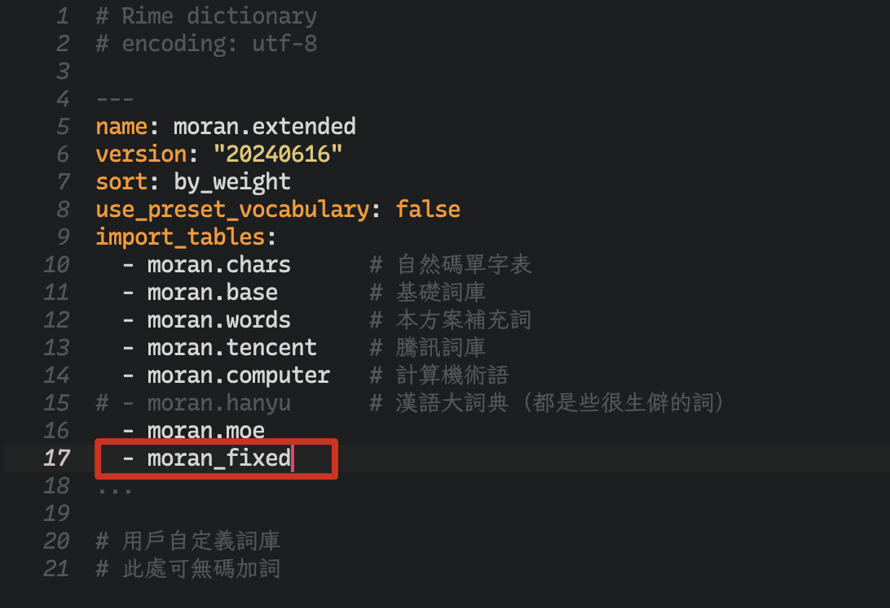

# 詞庫維護

## 如何造詞？

類整句模式（默認模式、整句模式、輔篩模式）下，任何連續輸入的文本都會被添加到**用戶詞庫**中。

字詞模式下，默認情況下只能打詞庫和用戶詞庫中有的詞。要添加新詞到**用戶詞庫**中，可以使用[單引號快捷加詞](../07.其他模式/00.魔然字词方案/特性说明.md#手動造詞鍵)。

[//]: # ()
類整句模式的用戶詞庫保存在用戶目錄下的 moran.userdb 中。該目錄是 LevelDB 數據庫文件，不能直接編輯修改，但可以用 Rime 提供的詞庫管理程序導出或導入 txt。

字詞模式的用戶詞庫保存在用戶目錄下的 moran\_fixed.txt 或 moran\_fixed\_simp.txt 中，可以直接使用文本編輯器查看和修改。

[//]: # ()

## 如何把詞語寫入詞庫文件？

**字詞模式**：編輯 moran\_fixed.dict.yaml（傳承字碼表）或 moran\_fixed\_simp.dict.yaml（簡化字碼表）。

**整句模式**：編輯 moran.extended.dict.yaml，

```
# 用戶自定義詞庫
# ^ 在此提示之後，按 <詞> <tab> <編碼> 的格式一行一個詞。

# 可以不加編碼，Rime 會自動生成編碼
魔然說明書

# 編碼可以任取，甚至字數和音節數不匹配也可以
# 通過這種方式可以使得整句中可以混入「簡碼」連打
什麼	sm
爲什麼	wsm
```

## 如何導入其他詞庫文件？

對於類整句方案（默認模式、整句模式、輔篩模式），編輯 moran.extended.dict.yaml，在 `import_tables` 下輸入自己的詞庫名。

[//]: # ()
詞庫需是原生雙拼詞庫。具體格式可參考 moran.base.dict.yaml。

**詞語編碼可以沒有輔碼**，但這樣的詞語在默認模式和整句模式中不能加輔（輔篩模式不受影響）。

我們提供[詞庫格式轉換工具](../06.工具/方案生成工具/README.md#命令-gen-dict)。

[//]: # ()

作爲一個用例，您可以把字詞模式詞庫完全導入到整句詞庫中（雖然不建議這樣的用法）：

<figure><figcaption></figcaption></figure>

## 附錄：有哪些詞庫文件？

詞庫文件分爲兩類：

* 整句詞庫，由類整句方案使用，包括**默認模式**、**整句模式**、**輔篩模式**
  * 上述方案直接引用 moran.extended.dict.yaml，該文件中導入以下詞庫
    * moran.chars.dict.yaml 單字全碼定義
    * moran.base.dict.yaml 核心詞庫
    * moran.words.dict.yaml 本方案擴充詞庫
    * moran.tencent.dict.yaml 騰訊詞向量詞庫
    * moran.computer.dict.yaml 計算機術語詞庫
    * moran.moe.dict.yaml 萌娘百科詞頭
    * moran.hanyu.dict.yaml 漢語大詞典（默認未開啓）
* 字詞和簡碼詞庫，由**字詞模式**和**默認模式**使用
  * moran\_fixed.dict.yaml 傳承字碼表
  * moran\_fixed\_simp.dict.yaml 簡化字碼表

