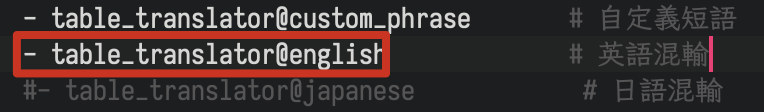

# 外語輸入

[//]: # ()
此處所說的外語輸入並不能實現一口氣輸入「我今天學了C語言」的效果。

[//]: # ()

## 英語輸入

默認**開啟**。英語詞庫文件爲 `moran_english.dict.yaml`。

<figure><figcaption><p>英語輸入效果</p></figcaption></figure>

要關閉該功能，可編輯 `moran.schema.yaml` 刪除或註釋掉 `table_translator@english`：

<figure><figcaption></figcaption></figure>

## 日語輸入（輕量級）

該功能爲輕量級日語混輸功能，只適合輸入偶爾夾雜的日語詞，不適合輸入句子。

默認**關閉**。日語詞庫文件爲 `moran_japanese.dict.yaml`。

<figure><figcaption><p>日語輸入效果</p></figcaption></figure>

要開啓日語輸入功能，請编辑 `moran.custom.yaml`：

```yaml
patch:
  schema/dependencies/+: [moran_japanese]
  engine/translators/+: [table_translator@japanese]
```

此外，方案還支持使用 `ojp` 引導純日語輸入，配置方法：

```
patch:
  schema/dependencies/+: [moran_japanese]
  engine/translators/+: [table_translator@japanese, table_translator@japanese_o]
```

## 全功能版日語輸入

推薦使用 Kuroame 製作的 rime-kagiroi 方案：該方案基於 mozc 詞庫並手動用 Lua 實現了 Viterbi 算法，是目前整句轉換效果最好的 Rime 日語方案。

[//]: # ()

參考配置方法：

1. 首先安裝 rime-kagiroi 方案，可通過 plum 安裝 rimeinn/rime-kagiroi 配方。
2. 修改 moran.custom.yaml（或其他對應方案的 custom.yaml）：

```yaml
patch:
  # 參考 rime-kagiroi 的 README
  schema/depenencies/+: [kagiroi]  # 增加依賴，可自動連帶部署 kagiroi 方案而無需增加到 schema_list 中
  engine/segmentors/@before 3: affix_segmentor@kagiroi  # 用於識別 ok 前綴
  engine/translators/+: [lua_translator@*kagiroi/kagiroi_translator]  # 增加 kagiroi 翻譯器
  kagiroi:  # 設置 ok 前綴
    prefix: ok
    tips: 〔カギロイ〕
    tag: kagiroi
  recognizer/patterns/kagiroi: '(^ok[a-z\-]*$)'  # 用於識別 ok 前綴
```

<figure><figcaption><p>輸入 ok 後可直接直接輸入完整日語句子</p></figcaption></figure>
